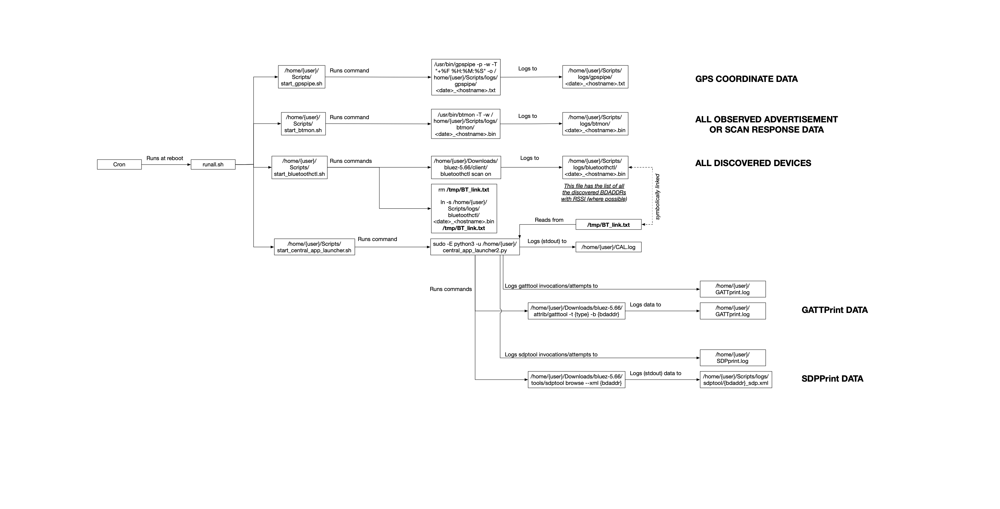

Welcome to Xeno's naive Bluetooth sniffing setup! It's cheap and easy and *good enough* to get started!

**Note: You probably *don't* want to use this repository, but instead want to use the more advanced successor (which is built on the same principles): [Blue2thprinting](https://github.com/darkmentorllc/Blue2thprinting).**

# Recommended Software

Use the official [Raspbian](https://www.raspberrypi.com/software/) Buster OS, and imaging utilities.

Tested most recently with [2023-05-03-raspios-buster-armhf.img.xz](https://downloads.raspberrypi.org/raspios_oldstable_armhf/images/raspios_oldstable_armhf-2023-05-03/2023-05-03-raspios-buster-armhf.img.xz). "Buster" is recommended instead of the newer "Bullseye" due to bugs in the GPS software bundled with Bullseye.

# OS Setup & Configuration

You will be required to walk through initial setup of the system on first boot.  
***The scripts in this repository assume that you will are using the default username of "pi".*** If you choose anything else you will have to update paths in the scripts.

### Set time to UTC:

`sudo timedatectl set-timezone UTC`

It simplifies mapping GPS times to host times if both are in UTC.

### Enable SSH:

I use SSH for getting logs off the device to a faster computer for processing.

```
	sudo su  
	cd /boot  
	touch ssh  
```
`sudo reboot` (or wait until after you change hostname below)

### Disable Wifi:

This is so that it doesn't waste power, and so that it doesn't compete with the Bluetooth for the use of the 2.4GHz antenna or spectrum.

`sudo nano /boot/config.txt`  
Under the line "Additional overlays and parameters are documented..." add:  
`dtoverlay=disable-wifi`  
`sudo reboot` (or wait until after you change hostname below)  

### Change hostname

If you're using multiple devices, you'll want to know which device saw which traffic. The scripts append the hostname to log files, so you'll need to use unique hostnames to distinguish where the log files came from.

`sudo raspi-config`
If prompted for which user the changes should apply to, select or type pi. Select "System Options" -> Hostname, and then set a new hostname like pi0-N, where this is your Nth system. Select Ok, and then navigate to Finish, and the reboot when prompted.

### Install prerequisite software:

```
sudo apt-get update
sudo apt-get upgrade -y
sudo apt-get install -y python3-pip python3-mysql.connector python3-docutils tshark mariadb-server gpsd gpsd-clients expect git net-tools openssh-server libusb-dev libdbus-1-dev libglib2.0-dev libudev-dev libical-dev libreadline-dev autoconf python2.7
```
Wireshark/tshark/dumpcap will prompt for whether non-super-users should be able to capture packets. Select yes.  

```
sudo pip3 install gmplot inotify_simple
```

**Check out *this repository* to a known location:**  

```
git clone --recurse-submodules https://github.com/darkmentorllc/naiveBTsniffing.git ~/naiveBTsniffing
```

Ensure that the Bluetooth assigned numbers sub-repository was successfully checked out by confirming that `~/naiveBTsniffing/Analysis/public` is not empty.


### Test GPS module:

If you type "gpsmon" at this point, you will not get any coordinates. The presence of coordinates will be our determination of correctness of operation.

*With your GPS module disconnected*, run: `ls -la /dev/ttyACM*`  
 - There should be no such file present. If there is something present, unplug all peripheral devices until you detect which device was causing that. Do not plug that device in again while operating this system.  
 - Plug in your USB GPS antenna, run `ls -la /dev/ttyACM*`  
 - The GPS device should now be visible as /dev/ttyACM0. ***The below will assume that /dev/ttyACM0 is the GPS device.***  

Change two lines from:

```
ListenStream=[::1]:2947
ListenStream=127.0.0.1:2947
```

to

```
#ListenStream=[::1]:2947
ListenStream=0.0.0.0:2947
```
Save the file and exit. (Note: this commented out the IPv6 address.)

```
gpsd /dev/ttyACM0 -F /var/run/gpsd.socket
systemctl daemon-reload
systemctl restart gpsd.socket
systemctl restart gpsd
```
You should now see GPS coordinates (assuming you're somewhere with visibility of the sky or otherwise in GPS range.) If you don't, reboot, and then run "sudo gpsmon" and confirm if you can then. (If you still can't, you're SOL, because Linux GPS has caused me enough trouble, and I'm not debugging yours `¯\_(ツ)_/¯`.)

Ctrl-c to exit gpsmon.

`gpspipe -V`
Confirm you are running version 3.17 (newer versions like 3.22 which is bundled with newer Raspbian OSes have known issues that prevent capturing the coordinates in our usage, with the GPS hardware recommended above.)

### Compile custom BlueZ tools (Optional)

I collect GATT data via a modified `gatttool` from the BlueZ tools. I also use the unmodified, but not compiled by default, `sdptool` to collect SDP info. If you want to use this, you will have to compile it on the target system (e.g. Raspberry Pi). My modified BlueZ-5.66 code is in this repository in the `bluez-5.66` folder.

Issue the following commands to copy the folder to Downloads (where other scripts will assume it's located), and then begin the Makefile generation:  

```
cp -r ~/Blue2thprinting/bluez-5.66 ~/Downloads/bluez-5.66
cd ~/Downloads/bluez-5.66
./configure --prefix=/usr --mandir=/usr/share/man --sysconfdir=/etc --localstatedir=/var --enable-experimental --enable-deprecated
```

If you have a username other than 'pi', update `~/Downloads/bluez-5.66/attrib/gatttool.c` and `~/Downloads/bluez-5.66/tools/sdptool.c` to correct the path in `g_log_name`.

```
make -j4
```

At the end you should confirm it has built by running the following commands:

```
~/Downloads/bluez-5.66/attrib/gatttool --help
~/Downloads/bluez-5.66/tools/sdptool --help
```

If there is an error of "Failed to open the file.", that means you failed to update the username in the `g_log_name` variable as mentioned above (or perhaps it already exists but you don't have permission because it was created by root.)

Custom BlueZ compilation will also build a custom `~/Downloads/bluez-5.66/client/bluetoothctl` which has an output format that's parsed by `central_app_launcher2.py`.

# Script interactions & data flow

Which scripts launch which other scripts, and what logs what data to where is captured in the below diagram (click for full size image.)




# Capture Scripts Setup

### Setup automatic script execution at boot:

```
cp -r ~/naiveBTsniffing/Scripts ~/Scripts
cp ~/Scripts/central_app_launcher2.py ~/central_app_launcher2.py
cd ~
sudo su
cd Scripts
chmod +x *.sh
crontab -e
```
Select nano, the best editor! :P  
Add to the bottom of the file:  
`@reboot /home/pi/Scripts/runall.sh`  
Save and exit  
`sudo reboot`  
After the system comes back up, run:  
`cd ~/Scripts`  
`./check.sh`  
If you are too quick, you will see things like `start_btmon.sh`, `start_bluetoothctl.sh`, or `start_gpspipe.sh`.  
But after their sleep timers have expired, they will transition to things like:

```
root       769  0.1  0.5   5216  2212 ?        S    15:05   0:00 /usr/bin/gpspipe -p -w -T +%F %H:%M:%S -o /home/pi/Scripts/logs/gpspipe/2024-04-22-15-04-36_pi0-1.txt
pi        1160  0.0  0.4   7328  2008 pts/1    S+   15:05   0:00 grep gpspipe
root       825  0.5  0.4   2780  2024 ?        S    15:05   0:00 /usr/bin/btmon -T -w /home/pi/Scripts/logs/btmon/2024-04-22-15-04-36_pi0-1.bin
pi        1172  0.0  0.4   7328  2024 pts/1    S+   15:05   0:00 grep btmon
root       895  2.1  1.0  18220  4472 ?        Sl   15:05   0:00 tclsh8.6 /usr/bin/unbuffer /home/pi/Downloads/bluez-5.66/client/bluetoothctl scan on
root       897  1.4  0.7   6988  3376 pts/0    Ss+  15:05   0:00 /home/pi/Downloads/bluez-5.66/client/bluetoothctl scan on
pi        1184  0.0  0.4   7328  1960 pts/1    S+   15:05   0:00 grep bluetoothctl
root       339  0.0  0.5   7648  2516 ?        S    15:04   0:00 /bin/bash /home/pi/Scripts/start_central_app_launcher.sh
root      1127  3.0  0.7   9932  3324 ?        S    15:05   0:00 sudo -E python3 -u /home/pi/central_app_launcher2.py
root      1136 52.0  2.4  19036 11008 ?        R    15:05   0:01 python3 -u /home/pi/central_app_launcher2.py
pi        1193  0.0  0.4   7328  2024 pts/1    S+   15:05   0:00 grep central_app
```
If your GPS is plugged in and working correctly, you should see all 3 of those sort of commands. From now on, whenever you reboot, the data collection will begin automatically.

You can cancel collection by running: `sudo ./killall.sh` from the `~/Scripts` folder.

If you want to manually restart the collection without a reboot, you can run: `sudo ./runall.sh` from the Scripts folder.
