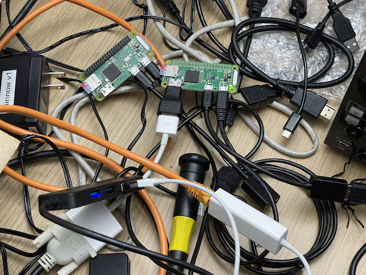

Welcome to Xeno's naive Bluetooth sniffing setup! It's cheap and easy and *good enough* to get started!

Note: the below hardware purchase links are Amazon affiliate links that support the [OpenSecurityTraining2](https://ost2.fyi) nonprofit.

# Assumed Hardware
(If you do not have any of the below, you will need to purchase.)

* Keyboard  
* Mouse  
* Monitor with HDMI input (or DVI input and an HDMI adapter. Note: Raspberry Pis have not worked with all monitors / adapter configurations for me.)  
* USB-micro male to USB-A male cable (to be used for power)  


# Recommended Hardware

The below recommends 2 of some things, just because it ends up being cheaper per-unit. Or because it's useful to have an extra if one dies. 

For devices where only 1 is recommended, it is assumed that you will only have one Raspberry Pi powered up at a time. If you intend to have both powered, you will need to increase to 2x.

* 2x - [Raspberry Pi Zero W](https://www.raspberrypi.com/products/raspberry-pi-zero/) - ~$10/unit
* * You can use a Raspberry Pi 4b if you already have one, but in my experiments they capture less data than the Pi Zero W.

* 2x - [64 GB micro SD card](https://amzn.to/3PahwSb) - ~$6/unit
* * If you don't have a way to mount microSD cards, will also require 1x [SD card to USB adapter](https://amzn.to/3KURtM1) - ~$7/unit

* 2x - [USB-micro male to USB-A female adapter](https://amzn.to/45Ip6bN) - ~$4/unit
* * The USB hub is plugged into this.

* 2x - [USB-A battery pack (38800mAh)](https://amzn.to/3YPa5mD) - ~$32/unit
* * You can use a smaller & cheaper battery if you don't need to leave the device unattended for days.

* 1x - [Non-separate-power USB-A hub](https://amzn.to/3qHCkXw) - ~$8/unit
* * *Note:* in my experience connecting an unpowered USB-A hub to the Pi Zero seems to cause too much of a power draw, and causes it to reboot. For this reason, while at home you may want to instead use a [powered USB hub](https://amzn.to/3YJU3u5) (even though it's more expensive.) However, the unpowered USB-A hub is necessary if you want to bring keyboard and mouse and GPS with you while driving around (e.g. if you think you may want to check on the status.)

* 1x - [HDMI-mini male to HDMI femle adapter](https://amzn.to/44javCF) - ~$3.50/unit

* 1x - [USB-A Ethernet Adapter](https://amzn.to/3qOezgr) - ~$10/unit
* * The Pi does not have a real time clock battery. Therefore if you power it off and power it on a week later, it will still think it's the previous time. I've been too lazy to wire up a battery, and instead I just use NTP to sync the time over the network whenever I power it on before a sniffing run. Also, I use Ethernet, because I disable the WiFi so that it doesn't waste power or compete with the Bluetooth for the antenna via "coexistence".

* 1x - [USB-A GPS receiver](https://amzn.to/44srqCJ) - ~$19/unit
* * Not necessary if you're only going to place sniffers at a single known location. Necessary if you're going to wander around and want to know where something was observed.

The following are only required if you'll be placing the devices into an outdoor environment for days at a time:

* 2x - [Lockable water-proof outdoor box](https://amzn.to/3OHsSeO) - ~$9/unit

* 2x - [Keyed Padlock](https://amzn.to/3P95PuM) - ~$10/unit

* 2x - [Flexible bike lock](https://amzn.to/3YOu7xf) - ~$9/unit
* * These [aren't particularly secure](https://www.youtube.com/shorts/dA9OsRal_L8), and indeed I forgot my combo at one point and had to pick my own. But they're just there to stop hobos and randos from walking off with your stuff ;).

Nice to have:

* 1x - [5" Mini screen](https://amzn.to/3QtlJj1) - ~$39/unit
* * If you are using the device for mobile sniffing, it's desirable to know if it's actually continuing to capture data, or whether it's crashed. You won't be able to tell that without a screen + the unpowered USB hub + keyboard + mouse.

* 1x - [Short & flexible HDMI cable](https://www.amazon.com/gp/product/B0B5TDFVVW/ref=ppx_yo_dt_b_search_asin_title?ie=UTF8&th=1) for above mini-screen - ~$14/unit

* You will need an additional USB micro male to USB A male cable (to be used for power for the mini-screen).

**If you bought everything correctly, your setup should look like this :P**



# Recommended Software

Use the official [Raspbian](https://www.raspberrypi.com/software/) OS, and imaging utilities.

Tested most recently with [2023-05-03-raspios-buster-armhf.img.xz](https://downloads.raspberrypi.org/raspios_oldstable_armhf/images/raspios_oldstable_armhf-2023-05-03/2023-05-03-raspios-buster-armhf.img.xz). "Buster" is recommended instead of the newer "Bullseye" due to bugs in the GPS software bundled with Bullseye.

# OS Setup & Configuration

You will be required to walk through initial setup of the system on first boot.  
***The scripts in this repository assume that you will are using the default username of "pi".*** If you choose anything else you will have to update paths in the scripts.

### Set time to UTC:

`sudo timedatectl set-timezone UTC`

It simplifies mapping GPS times to host times if both are in UTC.

### Enable SSH:

I use SSH for getting logs off the device to a faster computer for processing.

```
	sudo su  
	cd /boot  
	touch ssh  
```
`sudo reboot` (or wait until after you change hostname below)

### Disable Wifi:

This is so that it doesn't waste power, and so that it doesn't compete with the Bluetooth for the use of the 2.4GHz antenna or spectrum.

`sudo nano /boot/config.txt`  
Under the line "Additional overlays and parameters are documented..." add:  
`dtoverlay=disable-wifi`  
`sudo reboot` (or wait until after you change hostname below)  

### Change hostname

If you're using multiple devices, you'll want to know which device saw which traffic. The scripts append the hostname to log files, so you'll need to use unique hostnames to distinguish where the log files came from.

`sudo raspi-config`
If prompted for which user the changes should apply to, select or type pi. Select "System Options" -> Hostname, and then set a new hostname like pi0-N, where this is your Nth system. Select Ok, and then navigate to Finish, and the reboot when prompted.

### Install prerequisite software:

```
sudo apt-get update
sudo apt-get upgrade -y
sudo apt-get install -y python3-pip tshark mariadb-server gpsd gpsd-clients expect git net-tools
```
Wireshark/tshark/dumpcap will prompt for whether non-super-users should be able to capture packets. Select yes.  

```
sudo pip3 install gmplot inotify_simple
```

**Check out *this repository* to a known location:**  

```
git clone --recurse-submodules https://github.com/darkmentorllc/naiveBTsniffing.git ~/naiveBTsniffing
```

Ensure that the Bluetooth assigned numbers sub-repository was successfully checked out by confirming that `~/naiveBTsniffing/Analysis/public` is not empty.


### Test GPS module:

If you type "gpsmon" at this point, you will not get any coordinates. The presence of coordinates will be our determination of correctness of operation.

*With your GPS module disconnected*, run: `ls -la /dev/ttyACM*`  
 - There should be no such file present. If there is something present, unplug all peripheral devices until you detect which device was causing that. Do not plug that device in again while operating this system.  
 - Plug in your USB GPS antenna, run `ls -la /dev/ttyACM*`  
 - The GPS device should now be visible as /dev/ttyACM0. ***The below will assume that /dev/ttyACM0 is the GPS device.***  

Change two lines from:

```
ListenStream=[::1]:2947
ListenStream=127.0.0.1:2947
```

to

```
#ListenStream=[::1]:2947
ListenStream=0.0.0.0:2947
```
Save the file and exit. (Note: this commented out the IPv6 address.)

```
gpsd /dev/ttyACM0 -F /var/run/gpsd.socket
systemctl daemon-reload
systemctl restart gpsd.socket
systemctl restart gpsd
```
You should now see GPS coordinates (assuming you're somewhere with visibility of the sky or otherwise in GPS range.) If you don't, reboot, and then run "sudo gpsmon" and confirm if you can then. (If you still can't, you're SOL, because Linux GPS has caused me enough trouble, and I'm not debugging yours `¯\_(ツ)_/¯`.)

Ctrl-c to exit gpsmon.

`gpspipe -V`
Confirm you are running version 3.17 (newer versions like 3.22 which is bundled with newer Raspbian OSes have known issues that prevent capturing the coordinates in our usage, with the GPS hardware recommended above.)

### Compile custom BlueZ tools (Optional)

I collect GATT data via a modified `gatttool` from the BlueZ tools. I also use the unmodified, but not compiled by default, `sdptool` to collect SDP info. If you want to use this, you will have to compile it on the target system (e.g. Raspberry Pi).

My modified BlueZ-5.66 code is in this repository in the `~/naiveBTsniffing/bluez-5.66` folder. Issue `cp -r ~/naiveBTsniffing/bluez-5.66 ~/Downloads/bluez-5.66`, because scripts like "central\_app\_launcher2.py" assume it is in that location.

```
sudo apt-get install -y libusb-dev libdbus-1-dev libglib2.0-dev libudev-dev libical-dev libreadline-dev autoconf python3-docutils

```

If you are using a Raspberry Pi Zero W, running the recommended Linux distribution above, then you don't need to re-compile the code, as it is already compiled for that platform. If using a different system, proceed.

Then issue:

```
cd ~/Downloads/bluez-5.66
./configure --prefix=/usr --mandir=/usr/share/man --sysconfdir=/etc --localstatedir=/var --enable-experimental
```
Now you need to edit the Makefile and uncomment every line (and enclosing statement) that has a reference to "gatttool" or "sdptool" on it. (I don't know at the moment how to call ./configure in a way that will include it. If you know, LMK.)  


Then, if you have a username other than 'pi', update `~/Downloads/bluez-5.66/attrib/gatttool.c` to correct the path in `static char * g_log_name = "/home/pi/GATTprint.log";`

```
make -j4
```

At the end you should confirm it has built the `gatttool` executable file in `~/Downloads/bluez-5.66/attrib/gatttool` and the `sdptool` in `~/Downloads/bluez-5.66/tools/sdptool`.

This will also build a custom `~/Downloads/bluez-5.66/client/bluetoothctl` which has an output format that's parsed by `central_app_launcher2.py`.


# Capture Scripts Setup

### Setup automatic script execution at boot:

```
cp -r ~/naiveBTsniffing/Scripts ~/Scripts
cp ~/Scripts/central_app_launcher2.py ~/central_app_launcher2.py
cd ~
sudo su
cd Scripts
chmod +x *.sh
crontab -e
```
Select nano, the best editor! :P  
Add to the bottom of the file:  
`@reboot /home/pi/Scripts/runall.sh`  
Save and exit  
`sudo reboot`  
After the system comes back up, run:  
`cd Scripts`  
`./check.sh`  
If you are too quick, you will see things like `start_btmon.sh`, `start_bluetoothctl.sh`, or `start_gpspipe.sh`.  
But after their sleep timers have expired, they will transition to things like:

```
root      1506  0.3  0.5   5216  2268 pts/0    S    01:12   0:00 /usr/bin/gpspipe -p -w -T +%F %H:%M:%S -o /home/pi/Scripts/logs/gpspipe/2023-08-24-01-11-38_pi0-2.txt
root      1871  0.0  0.4   7328  1940 pts/0    S+   01:12   0:00 grep gpspipe
root      1504  0.6  0.4   2780  1960 pts/0    S    01:12   0:00 /usr/bin/btmon -T -w /home/pi/Scripts/logs/btmon/2023-08-24-01-11-38_pi0-2.bin
root      1873  0.0  0.4   7328  2020 pts/0    S+   01:12   0:00 grep btmon
root      1510  0.3  0.7   6740  3204 pts/0    S    01:12   0:00 /usr/bin/bluetoothctl scan on
root      1875  0.0  0.4   7328  2016 pts/0    S+   01:12   0:00 grep bluetoothctl
```
If your GPS is plugged in and working correctly, you should see all 3 of those sort of commands. From now on, whenever you reboot, the data collection will begin automatically.

You can cancel collection by running: `sudo ./killall.sh` from the Scripts folder.

If you want to manually restart the collection without a reboot, you can run: `sudo ./runall.sh` from the Scripts folder.

# Analysis Scripts Usage

After you have sniffed some traffic, you will have files in /home/pi/Scripts/logs/btmon/ and /home/pi/Scripts/logs/gpspipe/, that should be named the same as each other (timestamp followed by hostname) except that GPS files end in .txt and btmon in .bin.

**Note:** Because data parsing and database lookups can be CPU/IO intensive, it is generally recommended to *not* perform data import or analysis on the capture device (the Pi Zero in this case.) Rather, it is recommended to copy all data off to a separate, faster, analysis system, and perform the subsequent steps there.

### delete\_gps\_files\_lacking\_lat\_long.py

Often the GPS log will be continuing to log metadata even when it can't get a GPS coordinate fix. You should periodically deliminate any useless files that have no lat/long coordinates by running the following:

```
python3 delete_gps_files_lacking_lat_long.py /home/pi/Scripts/logs/gpspipe/
```

Any files that are deleted will be printed out. No output means no files were deleted.

### dump\_names\_specific.sh

Assume we have the following files:

```
root@pi0-2:/home/pi/Scripts# ls logs/btmon/
2023-08-24-01-04-59_pi0-2.bin  2023-08-24-01-11-38_pi0-2.bin
```

The named bluetooth devices found in multiple files can be dumped to stdout as follows:

```
./dump_names_specific.sh 2023-08-24-01-04-59_pi0-2.bin 2023-08-24-01-11-38_pi0-2.bin
Processing  /home/pi/Scripts/logs/btmon/2023-08-24-01-04-59_pi0-2.bin
btmon -T -r /home/pi/Scripts/logs/btmon/2023-08-24-01-04-59_pi0-2.bin.bin | grep -e "Name (.*):" | sort | uniq
Processing  /home/pi/Scripts/logs/btmon/2023-08-24-01-11-38_pi0-2.bin
btmon -T -r /home/pi/Scripts/logs/btmon/2023-08-24-01-11-38_pi0-2.bin.bin | grep -e "Name (.*):" | sort | uniq
All found names:
        Name (complete): This_is-not_real
        Name (complete): Neither is this😎
        Name (complete): BecauseWiGLEWouldTellYouWhereILive:P
```
from within the Scripts folder.

*Note:* The accepted name format is just the filename, not the full path. 

### map\_specific.sh

Assume we have the following files:

```
pi@pi0-2:~/Scripts $ ls logs/gpspipe/
2023-08-24-01-04-59_pi0-2.txt  2023-08-24-01-11-38_pi0-2.txt
```

If you have a file like `/home/pi/Scripts/logs/gpspipe/2023-08-24-01-11-38_pi0-2.txt` for instance, you can map the instances of *named* bluetooth devices. 

```
root@pi0-2:/home/pi/Scripts# ./map_specific.sh 2023-08-24-01-04-59_pi0-2 2023-08-24-01-11-38_pi0-2
passed in 
Processing  2023-08-24-01-04-59_pi0-2
Running as user "root" and group "root". This could be dangerous.
Processing  2023-08-24-01-11-38_pi0-2
Running as user "root" and group "root". This could be dangerous.
Adding markers

Done

root@pi0-2:/home/pi/Scripts# ls -la bt_map.html 
-rw-r--r-- 1 root root 9012 Aug 24 01:31 bt_map.html
```

The file bt_map.html can be opened in a browser to see the GPS locations of named devices.

*Note:* The accepted name format is just the filename, not the full path. You must remove the filetype suffix like ".txt" or ".bin".

## Import data into MySQL

**Note:** Because data parsing and database lookups can be CPU/IO intensive, it is generally recommended to *not* perform data import or analysis on the capture device (the Pi Zero in this case.) Rather, it is recommended to copy all data off to a separate, faster, analysis system, and perform the subsequent steps there.

### One time setup

**Linux Software Setup**: You should already have the necessary MySQL (MariaDB) database and tshark tools installed from the above apt-get commands.

**macOS Software Setup**: You can load the data into the database and perform analysis on macOS, but you must first [install HomeBrew](https://brew.sh/), and then run `brew install mysql` and `brew install wireshark` (for the `tshark` CLI version). (If for some reason neither tshark nor wireshark are found in your PATH, look in / add from /usr/local/Cellar/wireshark/). Then also edit `/usr/local/etc/my.cnf` and add `secure_file_priv = /tmp` at the end of the file, and then start the mysql server with `/usr/local/opt/mysql/bin/mysqld_safe --datadir=/usr/local/var/mysql`.

**Create initial database & tables**:

To create the "bt" database and all the necessary tables, run the following:  

```
cd ~/naiveBTsniffing/Analysis
sudo ./create_all_db_tables.sh
```

**Import the IEEE OUIs into the database**:

```
cd ~/naiveBTsniffing/Analysis
./process_OUI_lists.sh ./oui.txt
```

The oui.txt is from [https://standards-oui.ieee.org/oui/oui.txt](https://standards-oui.ieee.org/oui/oui.txt), and should be periodically updated. Also note that the `process_OUI_lists.sh` script does not currently handle OUI assignments that are less than 24 bits ([tracking issue](https://github.com/darkmentorllc/naiveBTsniffing/issues/1)).

**Import BT companies into the database**:

```
cd ~/naiveBTsniffing/Analysis`
./translator_fill_UUID16_to_company.sh
```

This should be re-run if you ever do a "git pull" in the `Blue2thprinting/public` directory, which contains the Bluetooth Assigned Numbers information, to get updated assigned vendor UUID16s.

### Importing data from btmon .bin files

`cd ~/naiveBTsniffing/Analysis`

Run `./fill_ALL_from_HCI_log.sh {your_btmon_file.bin}`.

E.g. `./fill_ALL_from_HCI_log.sh ../ExampleData/2023-10-06-08-52-20_up-apl01.bin`

You should see a variety of outputs such as "tsharking", and "mysql import". You can safely ignore any tshark warnings about the file being "cut short in the middle of a packet".

Eventually once you have many files to process in bulk, you will want to pass each file to `fill_ALL_from_HCI_log.sh` sequentially. For that you can issue a command like:

`time find /path/to/btmon_logs/2023-10* -type f -name "*.bin" | xargs -n 1 -I {} bash -c " ./fill_ALL_from_HCI_log.sh {}"`

**To confirm that some data was successfully imported, you can issue:**

```
mysql -u user -pa -D bt -e "SELECT * FROM LE_bdaddr_to_name LIMIT 10;"
```

This should show some of the same sort of device name data that you could see by the above `./dump_names_specific.sh` command.

### Importing GATT data from GATTprint.log

Both `central_all_launcher2.py` and `gatttool` log information attempt attempted and successful GATTprinting to the file `/home/pi/GATTprint.log` (or alt user home directory if you reconfigured it). To import this data into the database, run the following:

```
cp ~/Blue2thprinting/Analysis/parse_GATTPRINT_2db.py ~/
cd ~
cat GATTprint*.log | sort | uniq > GATTprint_dedup.log
python3 ./parse_GATTPRINT_2db.py
```

The above `cat` step is useful both to speed up the parsing of a single host's data (if it queried the same host multiple times), but also to combine data from multiple hosts, and avoid unnecessary duplicative mysql imports.

**To confirm that some data was successfully imported, you can issue:**

```
mysql -u user -pa -D bt -e "SELECT * FROM GATT_characteristics LIMIT 10;"
```

## Inspecting data with TellMeEverything.py

`cd ~/naiveBTsniffing/Analysis`

You will need Python3 installed, and you may need to change the path to the python3 interpreter at the beginning of the file. You will also need to do `pip3 install mysql-connector-python`, `pip3 install pyyaml` if you have not already.

Issue `python3 ./TellMeEverything.py --help` for the latest usage.

**If you get an error like "public/path/something can't be found"**, make sure your `~/naiveBTsniffing/Analysis/public` folder is not empty. If it is empty, that implies you didn't check out the Bluetooth assigned numbers sub-module at git repository clone time. This can be corrected by issuing `git submodule update --init --recursive`.

**Printing information for a specific BDADDR**:

`python3 ./TellMeEverything.py --bdaddr 4c:e6:c0:21:39:a6`

**Printing information for BDADDRs that have a name that matches a given regex**:

`python3 ./TellMeEverything.py --nameregex "^Flipper"`

The regex is used as a MySQL "REGEXP" statement, and thus must be valid MySQL regex syntax.

**Printing information for BDADDRs that have some data element that is associated with a company name that matches a given regex**:

`python3 ./TellMeEverything.py --nameregex "^Qualcomm"`

The regex is checked against associations with the BDADDR IEEE OUI, UUID16s, and BT/BLE CompanyID fields from link layer version information.

**Printing information for BDADDRs that have a UUID128 that matches a given regex**:

`python3 ./TellMeEverything.py --UUID128regex "02030302"`

**Printing information for BDADDRs that have Manufacturer Specific Data that matches a given regex**:

`python3 ./TellMeEverything.py --MSDregex "008fc3d5"`
